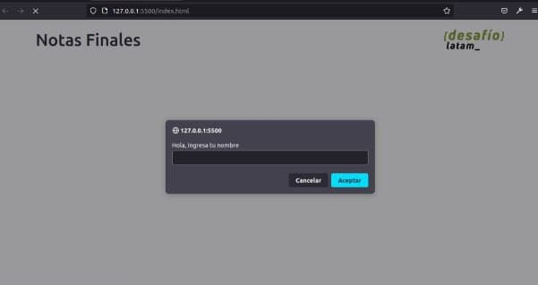
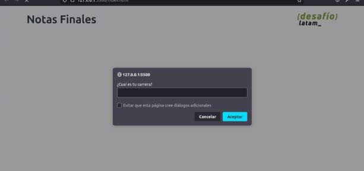
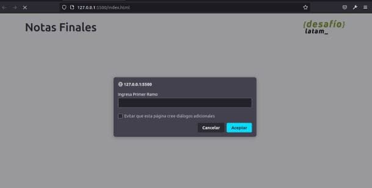
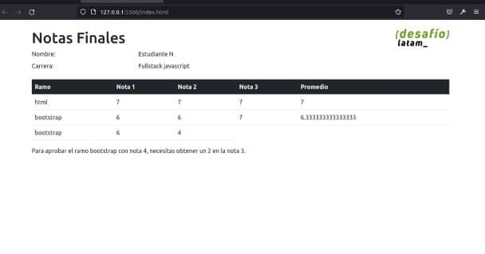

# Ejercicio Notas Finales con Javascript

La aplicación empieza de la siguiente manera:

1. Ingresar tu nombre

Luego das click en aceptar

2. Ingresar el nombre de la carrera 

3. A continuacion se visualizaran 3 ventanas 
donde se pide al usuario ingresar el nombre
de los 3 ramos de manera separada

finalmente javascript realizara el calculo 
para promediar las notas y mostralas en la siguiente 
imagen final de la aplicacion.

